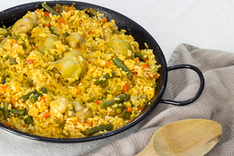

## Paella de verduras

 
Autor: [Delantal de Alces](https://delantaldealces.com/paella-de-verduras/)

### Ingredientes para 4 personas

- 300g de arroz bomba
- 800ml de caldo de verdura
- 200g. de champiñones
- 6 corazones de alcachofa en conserva
- 100g de judía verde redonda
- 3 cuacharadas soperas de tomate rallado (o triturado de lata)
- 1 cucharada de postre de concentrado de tomate
- ½ pimiento rojo
- ½ pimiento verde
- ½ cebolla
- 1 diente de ajo
- 1 pizca de azafrán
- ½ cucharada de cafe de pimentón dulce

### Preparación

Ponemos a calentar el caldo en una olla. Es importante incoporar el caldo ya caliente para no cortar la cocción del arroz.

Cortamos la cebolla y los pimientos en cuadraditos, picamos el ajo, limpiamos los champiñones y la judia verde.
A la judía verde le cortamos las puntas y las cortamos en trozos de unos 2-3 cm. Los champiñones los dejaremos enteros.
Dejamos a mano los corazones de alcahofa (escurridos si están en conserva).

Ponemos a calentar la paella en el fuego más grande.
Una vez caliente, añadimos un poco de aceite de oliva y sofreímos la cebolla.
Cuando coja color, añadimos el resto de las verduras (excepto los corazones de alcachofa) y el ajo picado.
Dejamos sofreír la verdura durante unos 5 minutos.

Añadimos el tomate y cuando haya perdido el agua, añadimos el arroz y rehogamos bien.

Añadimos ahora el caldo caliente, los corazones de alcachofa, el concentrado de tomate, el azafrán y el pimentón dulce.
Removemos un poco y dejamos cocer unos 20 minutos o hasta que ya no quede caldo.

Durante la cocción no deberíamos remover el arroz.
Para controlar el arroz únicamente es necesario agitar la paella de vez en cuando.
Si cocináis la paella en los fogones de casa, es posible que el calor no llegue bien a los bordes de la paella (sobretodo si los fogones son pequeños) y es posible que el arroz de los lados quede crudo.
Si es el caso, tocará saltarse las normas y, un par de veces durante la cocción, llevar el arroz de los lados hacia el centro.

Cuando ya no quede caldo y el arroz esté en su punto, apagamos el fuego y servimos.

\newpage
